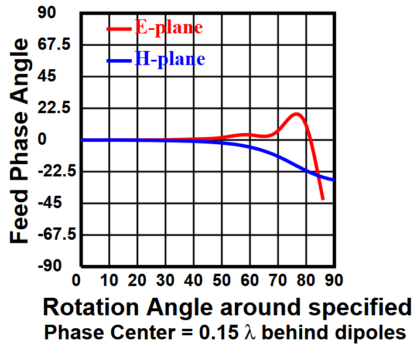

# How to interpret the PHASEPAT plots:

## Feed Phase Plot:
*In the upper right side.*

This plot shows the phase of the radiated wave in replasionshp to the rotation angle around the estimated phase center.

### But what does that mean?
The estimated phase center is the point from wich all the waves seem to eminate. This is estimated automaticly by the programm. If a more accurate result is needed one can run the `P` plot type.  
The rotation angle is just how far of we are from the center of the dish, so the `theta` value from our radiation pattern.  
And the Feed phases angle is just the phase at wich the wave arrives on the dish.  
So out of this graph we can gather what the phase does as we increas the illumination angle, `theta`.

### What is good and what is bad?
We want the red and blue line to stay as close to 0 as possible. Because the farther they deviate the larger our loss due to phase cancelation will get.  
This can be used to judge up to what illumination angle, or f/D, the feed would be usable.  
So in this example the feed is usable up to around 50 degrees of half illumination angle.  

